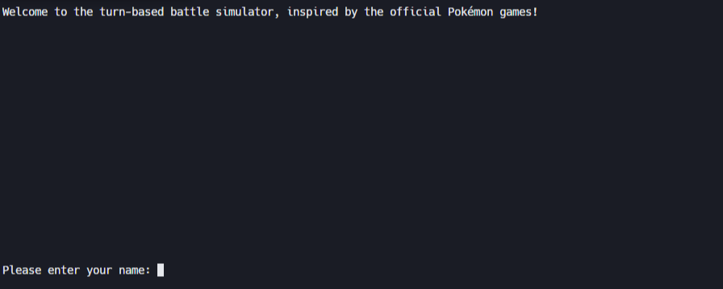
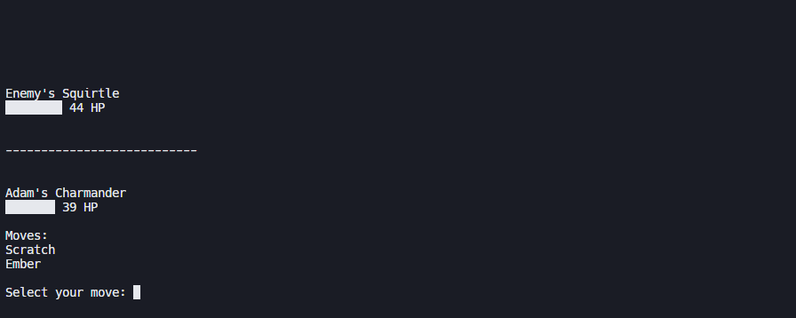
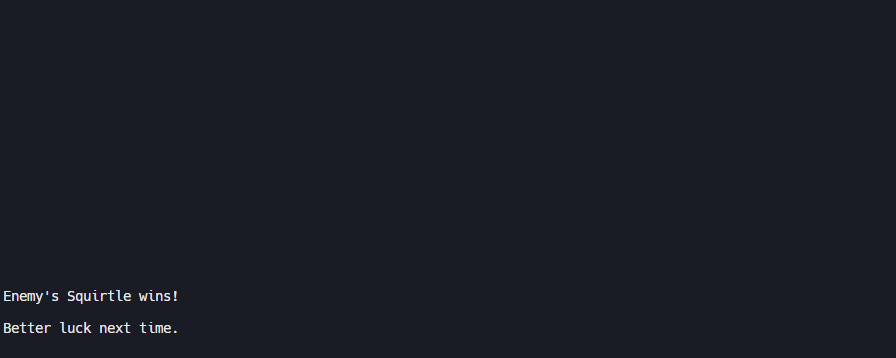

<h1>Terminal Arena</h1>
<h4>A terminal-based turn-based battle simulator inspired by classic Pokémon mechanics. Built to consolidate Python fundamentals including control flow, loops, functions, classes, dictionaries, JSON handling, modules, and file I/O.</h4> 

<h2>Features</h2>

- <h4>Player vs. AI turn-based battles</h4>
- <h4>Pokédex and move data stored in JSON</h4>
- <h4>Dynamic type effectiveness</h4>
- <h4>Random Pokémon generation for variety</h4>
- <h4>ASCII HP bar display</h4>

<h2>Technologies</h2>

<h2>Screenshots</h2>

